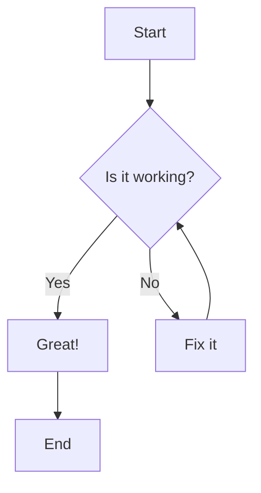
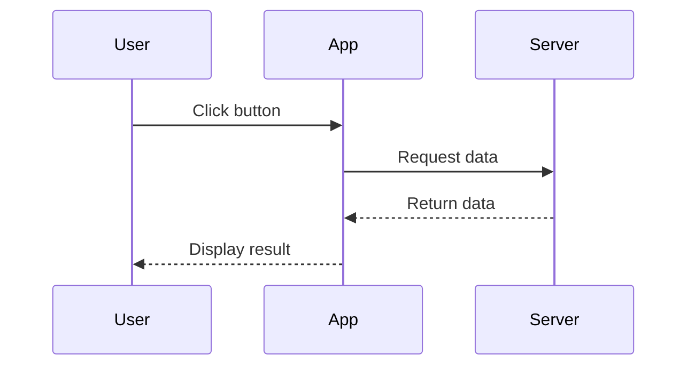
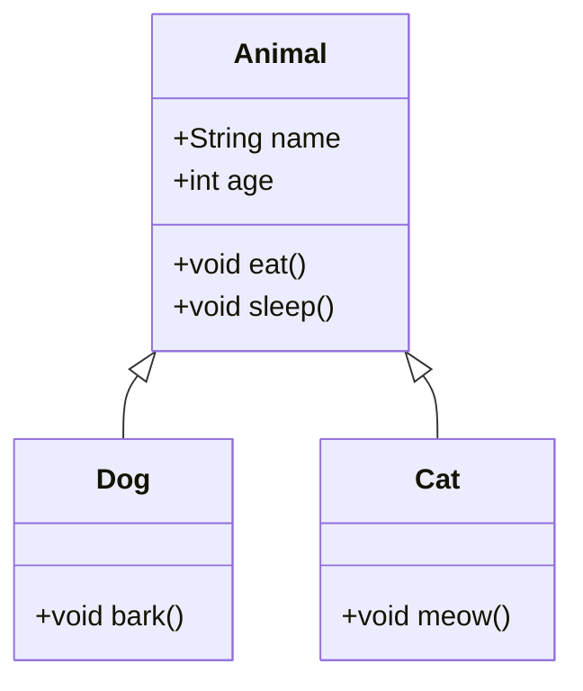
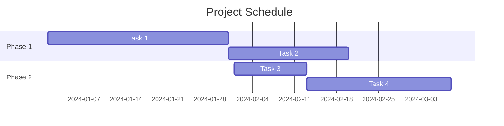
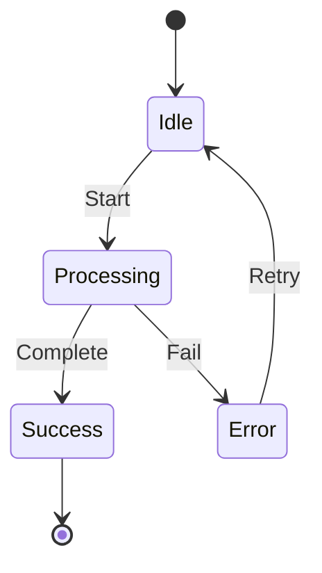

# Mermaid Diagram Test

This document contains various Mermaid diagrams to test the rendering functionality.

## Basic Flowchart



## Sequence Diagram



## Class Diagram



## Gantt Chart



## Regular Code Block

This is a regular code block that should not be treated as a Mermaid diagram:

```javascript
function hello() {
    console.log("Hello, World!");
}
```

## State Diagram



## End of Document

That's all for the Mermaid diagram test!